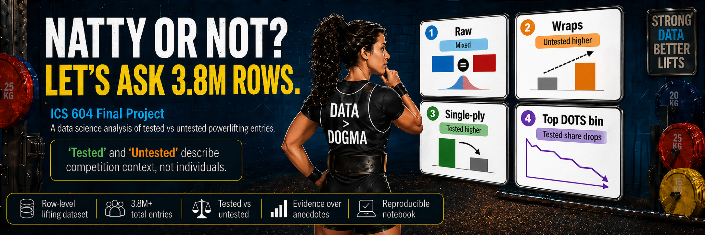

# Comparing Performance Patterns in Tested vs. Untested Powerlifting Competition Entries

**Jeff Wu | ICS 604: Applied Data Science | Spring 2026 | University of Hawaii at Manoa**



This project examines whether powerlifting competition entries differ in performance depending on whether the entry was drug tested or untested, using the OpenPowerlifting public dataset (~3.8 million records). The analysis compares TotalKg and DOTS scores across sex, weight class, equipment, performance level, and age.

## Repository Structure

```
.
├── notebook.ipynb                 # Analysis notebook
├── README.md                      # This file
├── requirements.txt               # Pinned Python dependencies
├── ICS604_final_report_Jeff.pdf   # Written report
├── data/                          # Dataset (not tracked)
├── images/                        # README image assets
```

## Clone the Repository  

Clone the repository to your local machine:

```bash
git clone https://github.com/wuj/ics604-final-project.git
```

## Get the Dataset

The dataset is too large to include in the repository (~782 MB, ~3.8 million rows). To reproduce the analysis:

1. Download the dataset from Github: https://github.com/wuj/ics604-final-project/releases/download/v1.0.0/openpowerlifting-2026-03-14.zip

2. This file is available as a **Github Release artifact** and has been pinned to OpenPowerlifting data revision **`dfb517af`** (dated March 14, 2026) for exact reproducibility.

3. Extract the contents of the ZIP file into the `data/` directory (already included in the repository). After extraction, you should have:
   ```
   data/LICENSE.txt
   data/openpowerlifting-2026-03-14-dfb517af.csv
   data/README.txt
   ```

4. The notebook's **Data Cleaning** cell will generate `data/powerlifting-clean.csv`.

## Requirements

**Python 3.13** with the packages listed in [`requirements.txt`](requirements.txt). No additional or non-standard libraries are needed. Developed on both Windows and macOS using Python 3.13.11.

### Install dependencies

```bash
pip install -r requirements.txt
```

## Running the Notebook  

The notebook is designed to run top-to-bottom in a single pass.  Always run all cells in order. 

[`ICS604_final_report_Jeff.pdf`](ICS604_final_report_Jeff.pdf) is the companion written report for this project. It gives a shorter summary of the research questions, methods, results, and conclusions. Read it alongside [`notebook.ipynb`](notebook.ipynb) if you want the narrative write-up in addition to the full reproducible analysis.

**Note:** A full Run All can take several minutes. The analysis runs 10,000 bootstrap resamples and 10,000 permutation shuffles across 78 subgroups (RQ1) and 12 age bins (RQ3), plus additional process illustrations. Expect the RQ1 test cell to be the longest-running cell.

### Option A: Jupyter Lab

After cloning the repository and installing dependencies (see [Requirements](#requirements) above), launch the notebook from the project folder:

```bash
cd ics604-final-project
jupyter lab notebook.ipynb
```
Run all cells in order. Click *restart the kernel and run all cells*.

### Option B: Anaconda

After cloning the repository (see [Clone the Repository](#clone-the-repository) above), launch the notebook through Anaconda:

1. Download and install [Anaconda](https://www.anaconda.com/download).
2. Open the Anaconda environment you plan to use for this project.
3. Install the pinned packages from [`requirements.txt`](requirements.txt) in that environment:
   ```bash
   pip install -r requirements.txt
   ```
4. Open **Anaconda Navigator** and launch **Jupyter Notebook** or **JupyterLab** from that same environment.
5. Navigate to the cloned project folder and open `notebook.ipynb`.
6. Run all cells in order (*Run > Run All Cells*).

Anaconda includes Python and Jupyter, but it may not include the exact package versions pinned in [`requirements.txt`](requirements.txt). Installing from `requirements.txt` helps avoid version mismatch problems.

### Option C: Python venv

This option creates a self-contained Python environment so the pinned packages from [`requirements.txt`](requirements.txt) do not affect any other Python project on the machine. After cloning the repository (see [Clone the Repository](#clone-the-repository) above) and downloading the dataset (see [Get the Dataset](#get-the-dataset) above):

1. From the project folder, create and activate a fresh virtual environment:
   ```bash
   cd ics604-final-project
   python3 -m venv .venv
   source .venv/bin/activate
   ```

2. Install the pinned packages into the environment:
   ```bash
   pip install -r requirements.txt
   ```

3. Launch JupyterLab from the activated environment and open the notebook:
   ```bash
   jupyter lab notebook.ipynb
   ```

4. Run all cells in order (*Restart Kernel and Run All Cells*).

When finished, deactivate the environment with `deactivate`, or simply close the shell.

## Verifying a Successful Run

A complete run produces **16 inline figures** and no errors. Key checkpoints:

- The **Data Cleaning** cell prints filtering removal counts and the final cleaned shape, and writes `data/powerlifting-clean.csv`.
- The **RQ1 Summary Table** cell prints the number of qualifying subgroup pairs.
- The **RQ1 Results Summary** cell prints a breakdown of significant vs. non-significant subgroups for TotalKg and DOTS.
- The **RQ2 Bin Diagnostics and Chi-Squared Tests** cell prints contingency tables and chi-square test results for men and women.
- The **RQ3 Interval Evidence** cell prints a summary line: "Summary: X of 12 age bins have a one-sided 95% lower bound above zero."

If any cell raises an error, restart the kernel and re-run all cells from the top -- earlier cells define variables that later cells depend on.
